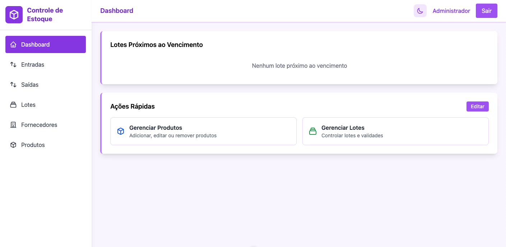

# Do QA ao Dev: Como Criei Meu Próprio Sistema de Testes com Ajuda de IA

## A jornada de um Quality Assurance que construiu um sistema completo de controle de estoque para testar — e chegou a 119 testes E2E automatizados

---



---

## A História de um QA que Virou Dev (Temporariamente)

Sou Quality Assurance. Meu trabalho é testar software, encontrar bugs, garantir qualidade. Mas sempre tive uma frustração: **testar sistemas que outras pessoas fazem**.

E se eu pudesse criar meu próprio sistema? Um sistema feito especificamente para eu testar? Com todas as complexidades que eu quisesse validar?

A resposta veio quando descobri que, com ajuda de IA, eu — um QA sem experiência em desenvolvimento full-stack — poderia construir um sistema completo.

Este artigo conta como criei um sistema de controle de estoque do zero, com backend, frontend e 119 testes E2E. Tudo isso sendo QA, não desenvolvedor.

---

## Por Que um Sistema de Controle de Estoque?

Como QA, eu queria um sistema que tivesse:
- **Complexidade real** - não um simples CRUD
- **Regras de negócio** - validações, cálculos, integridade
- **Integrações** - múltiplas entidades relacionadas
- **Casos extremos** - cenários que todo QA adora testar

Controle de estoque tem tudo isso:
- **Produtos** com categorias e unidades de medida
- **Lotes** com rastreamento de validade
- **Movimentações** de entrada e saída que afetam estoque
- **Fornecedores** com validações de CPF/CNPJ
- **Alertas** de produtos vencendo ou vencidos

Perfeito para testar!

### Stack Tecnológica

**Backend:**
- Node.js + Express
- MySQL
- Swagger para documentação

**Frontend:**
- Nuxt.js 3
- Vue 3 + Composition API
- TailwindCSS
- Tema claro/escuro

**Testes:**
- Playwright
- Page Object Model
- Execução paralela (4 workers)

---

## Como um QA Constrói um Sistema? Com IA!

### Fase 1: "Eu Preciso de Algo para Testar"

Minha primeira conversa com a IA:

> **Eu:** "Sou QA e quero criar um sistema de controle de estoque para testar. Precisa ter backend, frontend e ser complexo o suficiente para valer a pena. O que você sugere?"

A IA não apenas sugeriu a stack, mas **explicou em termos que eu entendesse**:
- Node.js + Express (backend simples de entender)
- MySQL (integridade de dados - crucial para QA)
- Nuxt 3 + Vue (frontend moderno)
- Playwright (minha zona de conforto!)

**Resultado:** Em poucas horas tinha um projeto rodando. Eu, um QA, com backend e frontend funcionando!

### Fase 2: Pensando Como QA, Construindo Como Dev

Aqui minha experiência como QA brilhou. Eu sabia **exatamente** o que queria testar.

**Exemplo real - Sistema de Lotes:**

**Eu (pensando como QA):** "Preciso que o lote mostre status visual: verde se válido, amarelo se vencendo em 30 dias, vermelho se vencido. Quero testar os três estados e as transições entre eles."

A IA entregou:
```javascript
const getStatusLote = (dataValidade) => {
  const hoje = new Date();
  const validade = new Date(dataValidade);
  const diasRestantes = Math.ceil((validade - hoje) / (1000 * 60 * 60 * 24));
  
  if (diasRestantes < 0) return { texto: 'Vencido', cor: 'red' };
  if (diasRestantes <= 30) return { texto: 'Próximo ao vencimento', cor: 'yellow' };
  return { texto: 'Válido', cor: 'green' };
};
```

Funcionou de primeira. E o melhor: **eu consegui testar imediatamente**. Mudei a data de validade e vi as cores mudando. QA feliz!

### Fase 3: Encontrando Bugs no Meu Próprio Sistema

Aqui foi engraçado. Eu estava testando (meu trabalho!) e encontrei bugs no sistema que eu mesmo "criei".

**Bug 1: Duplicação de Estoque**

Como bom QA, testei o fluxo completo:
1. Criar entrada de 100 unidades
2. Verificar lote
3. Resultado: 200 unidades (?!)

**Eu:** "IA, o estoque está duplicando. Criei entrada de 100, mas o lote mostra 200."

A IA identificou: o lote iniciava com a quantidade, e a movimentação somava novamente.

**Solução:** Lote inicia com `quantidade_atual = 0`, apenas movimentações alteram o estoque.

```javascript
// Antes (errado)
const lote = await Lote.create({
  quantidade_atual: dados.quantidade // ❌ Duplica
});

// Depois (correto)
const lote = await Lote.create({
  quantidade_atual: 0 // ✅ Movimentação ajusta depois
});
```

**Bug 2: Modal de Fornecedor Travando**

**Eu (testando fluxo):** "Cliquei para criar fornecedor durante a entrada, salvei, mas o modal não fecha e o fornecedor não aparece no select."

**IA:** "Formulários aninhados causam conflito. Vou criar um modal independente."

Depois de ajustar, testei novamente: funcionou perfeitamente. **Bug encontrado e corrigido por um QA!**

---

## A Jornada dos 119 Testes: QA no Comando

Aqui está o ponto alto: **119 testes end-to-end, todos passando**.

### Por Que Tantos Testes?

Porque sou QA! Não consigo ver uma funcionalidade sem pensar:
- E se o usuário deixar o campo vazio?
- E se colocar valor negativo?
- E se excluir enquanto tem dados relacionados?
- E se...

Cada "e se" virou um teste.

**Distribuição:**
- Login: 10 cenários
- Dashboard: 14 cenários
- Produtos: 15 cenários
- Entradas: 19 cenários
- Saídas: 19 cenários
- Lotes: 21 cenários
- Fornecedores: 21 cenários

### Como a IA Ajudou nos Testes

#### 1. Page Object Model

**Eu:** "Conheço Playwright, mas como organizo 119 testes sem virar bagunça?"

**IA:** "Page Object Model. Você cria classes que representam cada página."

A IA sugeriu Page Object Model e gerou a estrutura:

```javascript
// pages/EntradasPage.js
export class EntradasPage {
  constructor(page) {
    this.page = page;
    this.btnNovo = '[data-testid="btn-nova-entrada"]';
    this.inputProduto = '[data-testid="produto-nome"]';
    this.inputLote = '[data-testid="lote-numero"]';
  }

  async abrirModal() {
    await this.page.click(this.btnNovo);
    await this.page.waitForSelector('[data-testid="modal-entrada"]');
  }

  async preencherFormulario(dados) {
    await this.page.fill(this.inputProduto, dados.produto);
    await this.page.fill(this.inputLote, dados.lote);
    await this.page.fill('[data-testid="quantidade"]', dados.quantidade);
    // ...
  }

  async salvar() {
    await this.page.click('[data-testid="btn-salvar"]');
    await this.page.waitForSelector('.toast-success');
  }
}
```

**Resultado:** Testes organizados como eu sempre quis ver nos projetos que testo!

#### 2. Estratégia de Limpeza

**Eu (frustrado):** "Os testes passam sozinhos, mas falham quando rodo todos juntos!"

**IA:** "Dados residuais. Precisa limpar o banco após cada teste."

Criamos um sistema de cleanup:

```javascript
// helpers/cleanup.js
export async function limparDados(page) {
  await page.request.delete('http://localhost:3001/api/test/cleanup');
}

// Uso em cada teste
test.afterEach(async ({ page }) => {
  await limparDados(page);
});
```

#### 3. Testes Paralelos

**Eu:** "119 testes levam 8 minutos. Muito tempo!"

**IA:** "Execução paralela com 4 workers."

A IA configurou execução paralela com dados únicos:

```javascript
// playwright.config.js
export default {
  workers: 4, // 4 testes simultâneos
  use: {
    baseURL: 'http://localhost:3000',
  }
};

// Gerando CNPJ único por teste
const cnpj = `12345678${Date.now().toString().slice(-6)}`;
```

**Resultado:** 2 minutos! Agora sim, eficiência de QA.

---

## Exemplos de Testes: Pensamento de QA

### Teste 1: Fluxo Completo (O Teste que Todo QA Ama)

```javascript
test('Fluxo completo: entrada → lote → saída', async ({ page }) => {
  const entradas = new EntradasPage(page);
  const lotes = new LotesPage(page);
  const saidas = new SaidasPage(page);

  // 1. Criar entrada
  await entradas.criar({
    produto: 'Arroz Integral',
    lote: 'LOTE-001',
    quantidade: '100',
    validade: '2025-12-31'
  });

  // 2. Verificar lote criado
  await lotes.navegar();
  await expect(page.locator('text=LOTE-001')).toBeVisible();
  await expect(page.locator('text=100.00')).toBeVisible();

  // 3. Criar saída
  await saidas.criar({
    lote: 'LOTE-001',
    quantidade: '30'
  });

  // 4. Verificar estoque atualizado
  await lotes.navegar();
  await expect(page.locator('text=70.00')).toBeVisible();
});
```

### Teste 2: Validação de Campos (Clássico de QA)

```javascript
test('Validar campos obrigatórios em entrada', async ({ page }) => {
  const entradas = new EntradasPage(page);
  
  await entradas.abrirModal();
  await entradas.salvar(); // Tenta salvar vazio

  // Verifica mensagens de erro
  await expect(page.locator('text=Este campo é obrigatório')).toHaveCount(8);
  
  // Verifica asteriscos nos labels
  await expect(page.locator('label:has-text("*")')).toHaveCount(8);
});
```

### Teste 3: Exclusão em Cascata (Teste de Integridade)

```javascript
test('Excluir entrada deve remover lote automaticamente', async ({ page }) => {
  const entradas = new EntradasPage(page);
  const lotes = new LotesPage(page);

  // Criar entrada (cria lote automaticamente)
  await entradas.criar({ produto: 'Feijão', lote: 'LOTE-002' });

  // Verificar lote existe
  await lotes.navegar();
  await expect(page.locator('text=LOTE-002')).toBeVisible();

  // Excluir entrada
  await entradas.navegar();
  await entradas.excluirPrimeiro();

  // Verificar lote foi removido
  await lotes.navegar();
  await expect(page.locator('text=LOTE-002')).not.toBeVisible();
});
```

---

## Desafios Técnicos e Soluções

### 1. Controle de Estoque Preciso

**Desafio:** Garantir que entrada/saída sempre reflitam corretamente no estoque.

**Solução com IA:**
- Transações no banco de dados
- Lote inicia zerado
- Apenas movimentações alteram quantidade
- Testes validam cada cenário

```javascript
// Backend - service de movimentações
async criar(dados) {
  const connection = await db.getConnection();
  await connection.beginTransaction();

  try {
    // Criar movimentação
    const [result] = await connection.execute(
      'INSERT INTO movimentacoes (...) VALUES (...)',
      [dados]
    );

    // Atualizar estoque do lote
    const operador = dados.tipo === 'entrada' ? '+' : '-';
    await connection.execute(
      `UPDATE lotes SET quantidade_atual = quantidade_atual ${operador} ? WHERE id = ?`,
      [dados.quantidade, dados.lote_id]
    );

    await connection.commit();
    return result;
  } catch (error) {
    await connection.rollback();
    throw error;
  }
}
```

### 2. Sistema de Alertas em Tempo Real

**Desafio:** Mostrar lotes vencendo/vencidos sem sobrecarregar o banco.

**Solução com IA:**
- Endpoints específicos para alertas
- Cálculo de datas no backend
- Contadores eficientes

```javascript
// Backend - controller de alertas
async getVencendo(req, res) {
  const query = `
    SELECT l.*, p.nome as produto_nome
    FROM lotes l
    JOIN produtos p ON l.produto_id = p.id
    WHERE l.data_validade BETWEEN CURDATE() AND DATE_ADD(CURDATE(), INTERVAL 30 DAY)
    AND l.quantidade_atual > 0
    ORDER BY l.data_validade ASC
  `;
  
  const [lotes] = await db.execute(query);
  res.json(lotes);
}
```

### 3. UX: Validações e Feedback

**Desafio:** Formulários complexos precisam de validação clara.

**Solução com IA:**
- Mensagens específicas por campo
- Asteriscos em campos obrigatórios
- Toasts com 4 tipos (success, error, warning, info)
- Validação antes do submit

```vue
<!-- Frontend - componente de entrada -->
<template>
  <div>
    <label>
      Nome do Produto <span class="text-red-500">*</span>
    </label>
    <input 
      v-model="form.produto" 
      data-testid="produto-nome"
      @blur="validarCampo('produto')"
    />
    <span v-if="erros.produto" class="text-red-500 text-sm">
      Este campo é obrigatório
    </span>
  </div>
</template>
```

---

## Métricas e Resultados

### Cobertura de Testes

✅ **119 testes passando**  
⚡ **Execução paralela** (4 workers)  
🎯 **100% de taxa de sucesso**  
⏱️ **Tempo médio:** ~2 minutos para suite completa  
🔄 **CI/CD ready**

### Funcionalidades Validadas

- ✅ Autenticação e autorização
- ✅ CRUD completo de todas entidades
- ✅ Controle de estoque preciso
- ✅ Sistema de alertas
- ✅ Validações de formulário
- ✅ Exclusões em cascata
- ✅ Formatações automáticas (CPF, CNPJ, telefone)
- ✅ Tema claro/escuro
- ✅ Responsividade

### Tempo de Desenvolvimento

**Com IA:** ~3 semanas (part-time)  
**Estimativa sem IA:** 2-3 meses

---

## O Que Aprendi Como QA Virando Dev

### 1. QA Sabe Mais de Desenvolvimento do Que Pensa

Eu achava que não sabia programar. Mas descobri que:
- Entendo lógica (testo ela todo dia)
- Sei o que é API REST (testo elas)
- Conheço banco de dados (valido dados)
- Entendo fluxos complexos (crio casos de teste)

**A IA só traduziu meu conhecimento de QA em código.**

### 2. QA Escreve Requisitos Melhores

Como QA, sou treinado para ser específico:

❌ "Crie um sistema de estoque" (desenvolvedor genérico)  
✅ "Crie um endpoint que liste lotes vencendo nos próximos 30 dias, ordenados por data de validade, incluindo nome do produto" (QA específico)

A IA adorou minha clareza!

### 3. QA Questiona Tudo (Até Código de IA)

Meu instinto de QA não desligou:
- "Por que usar transação aqui?" (testando integridade)
- "E se o banco cair no meio?" (testando falhas)
- "Como isso escala com 10.000 lotes?" (testando performance)

A IA explicou tudo. Aprendi muito.

### 4. Testar Meu Próprio Sistema é Libertador

Sempre testei sistemas de outros. Agora:
- **Eu decido** o que implementar
- **Eu crio** os cenários complexos que quero
- **Eu corrijo** os bugs que encontro
- **Eu aprendo** vendo o código que a IA gera

É como ser QA e dev ao mesmo tempo!

### 5. QA + IA = Combinação Perfeita

- **QA sabe** o que testar
- **IA sabe** como implementar
- **QA valida** se está correto
- **IA corrige** o que está errado

Ciclo perfeito!

---

## Lições para Outros QAs que Querem Tentar

### 1. Você Sabe Mais do Que Pensa

Se você é QA:
- ✅ Entende fluxos de usuário
- ✅ Conhece regras de negócio
- ✅ Sabe validar dados
- ✅ Pensa em casos extremos

**Isso é 80% do desenvolvimento!** A IA faz os outros 20% (sintaxe).

### 2. Fale com a IA Como Escreve Casos de Teste

Sua habilidade de QA é seu superpoder:

**Caso de teste:**
```
Dado que existe um lote com 100 unidades
Quando eu criar uma saída de 30 unidades
Então o lote deve ter 70 unidades
```

**Para a IA:**
```
"Preciso que ao criar uma saída, o sistema subtraia 
a quantidade do lote. Exemplo: lote com 100, saída 
de 30, resultado 70."
```

A IA entende perfeitamente!

### 3. Teste o Código da IA (Óbvio!)

Você é QA! Faça o que sabe:
- ✅ Teste casos normais
- ✅ Teste casos extremos
- ✅ Teste casos de erro
- ✅ Encontre bugs
- ✅ Peça para IA corrigir
- ✅ Teste novamente

É seu trabalho, só que agora no seu próprio sistema!

### 4. Comece com Algo que Você Quer Testar

Escolha um domínio que você conhece:
- E-commerce (se testa e-commerce)
- Financeiro (se testa bancos)
- Saúde (se testa hospitais)

Você já conhece as regras. A IA só implementa.

### 5. Não Tenha Medo de Errar

Eu quebrei o sistema várias vezes:
- Deletei tabelas sem querer
- Criei loops infinitos
- Travei o banco de dados

**E daí?** Era meu sistema. Aprendi consertando.

---

## Ferramentas que Usei (QA Raiz)

### Desenvolvimento (Novo para Mim)
- **VS Code** - IDE (aprendi a usar)
- **Amazon Q / ChatGPT** - Meu "par" desenvolvedor
- **Node.js** - Backend (a IA instalou)
- **MySQL Workbench** - Banco (já conhecia de testar)

### Testes (Minha Casa)
- **Playwright** - Minha ferramenta favorita
- **Playwright Inspector** - Debug (uso todo dia)
- **Postman** - APIs (já usava para testar)

### Documentação
- **Swagger** - Documentação da API (a IA configurou)
- **Markdown** - README (escrevi eu mesmo!)

---

## O Código Está Disponível

Todo o projeto está no GitHub: [https://github.com/Gustavogds55/controle-estoque]

Inclui:
- ✅ Código completo (backend + frontend)
- ✅ 119 testes E2E
- ✅ Scripts de banco de dados
- ✅ Documentação completa
- ✅ Instruções de instalação
- ✅ Collection do Postman

---

## Próximos Passos

O projeto está funcional, mas sempre há espaço para melhorias:

### Funcionalidades
- [ ] Relatórios e dashboards avançados
- [ ] Exportação para Excel/PDF
- [ ] Notificações por email de alertas
- [ ] Histórico de alterações (audit log)
- [ ] Múltiplos usuários com permissões

### Técnico
- [ ] Deploy em produção (AWS/Vercel)
- [ ] CI/CD com GitHub Actions
- [ ] Testes de performance
- [ ] Monitoramento e logs
- [ ] Docker para facilitar setup

---

## Conclusão: QA Pode Programar (Com Ajuda)

Este projeto provou algo importante: **QA tem as habilidades certas para programar**.

Nós já:
- ✅ Entendemos lógica
- ✅ Pensamos em casos extremos
- ✅ Validamos regras de negócio
- ✅ Documentamos processos
- ✅ Encontramos problemas

A IA só preenche a lacuna da sintaxe.

### Para QAs que Estão Lendo

Se você sempre quis criar seu próprio sistema para testar, **agora é a hora**.

Não precisa ser desenvolvedor. Precisa ser curioso.

Não precisa saber todas as linguagens. A IA sabe.

Não precisa fazer tudo perfeito. Você é QA, vai encontrar os bugs!

### O Que Mudou para Mim

Agora quando testo sistemas de outros, penso:
- "Eu faria diferente"
- "Eu testaria isso"
- "Eu implementaria assim"

E o melhor: **agora eu posso fazer**.

### Comece Hoje

1. Escolha algo simples que você quer testar
2. Abra uma conversa com IA (ChatGPT, Claude, Amazon Q)
3. Diga: "Sou QA e quero criar [seu sistema] para testar"
4. Siga as instruções
5. Teste tudo (você sabe fazer isso!)

**Não precisa ser 119 testes de uma vez. Comece com 1.**

E lembre-se: você não está virando desenvolvedor. Você está sendo um QA melhor.

---

## Sobre o Autor

Gustavo Gonçalves, Quality Assurance apaixonado por testes automatizados e qualidade de software. Este é meu primeiro projeto como "desenvolvedor" (com muitas aspas e ajuda de IA), mas definitivamente não será o último.

Provei para mim mesmo que QA pode criar sistemas. E você também pode.

**Conecte-se comigo:**
- GitHub: [https://github.com/Gustavogds55/controle-estoque]
- LinkedIn: [www.linkedin.com/in/gustavogds]


---

**Tags:** #QualityAssurance #QA #Playwright #Testing #E2ETesting #AI #InteligenciaArtificial #AutomationTesting #SoftwareTesting

---

**Gostou do artigo?** 
- 👏 Deixe alguns claps
- 💬 Comente sua experiência com IA
- 🔄 Compartilhe com outros devs
- ⭐ Dê uma estrela no GitHub

**Dúvidas?** Deixe nos comentários que respondo todos!
